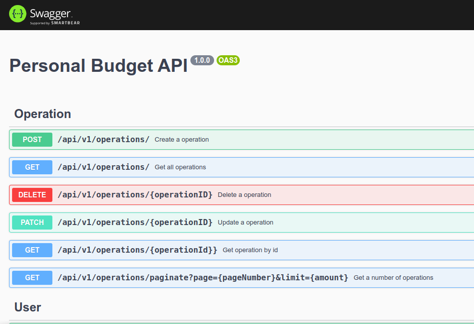

<h1 align="center">My budget app</h1> 

  
<h1>Description</h1>

Web application to keep track of our budget based on our expenses and income developed with Express and Vue

 
<h1>API</h1>

The project's api is developed under the layered architecture and has a token-based authentication system. It has endpoints to register and authenticate users by means of tokens as well as endpoints for the basic operations of the transaction crud. 

 
<h1>Client</h1>

The web client is a simple application developed with vue with which to consume the api

 
<h1>Installation</h1>
<ol>
    <li>Clone the repository  <a>https://github.com/Behelit0906/expense-app.git</a> </li>
    <li>Enter the api folder and install its dependencies with the command npm i </li>
    <li>Enter the web folder and install its dependencies with the command npm i </li>
    <li>import the database schema found in /api/src/personal_budget.sql into your database engine.</li>
    <li>Create the .env file inside the api folder and configure it based on the .env.example file.</li>
    <li>Create the .env file inside the web folder and configure it based on the .env.example file.</li>
    <li>Inside the api folder execute the npm run dev command to run this.</li>
    <li>Inside the web folder, run the command npm run dev to run the web application.</li>
</ol>
